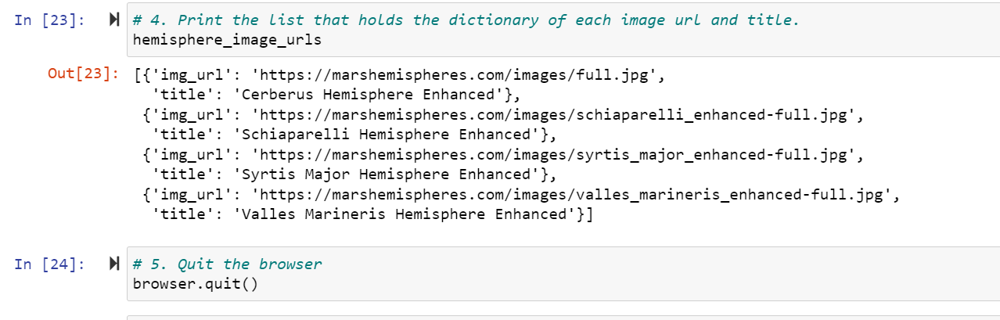
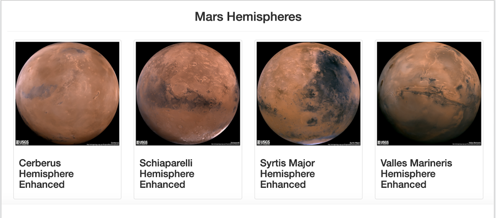

# Mission-to-Mars
Intro to Webscariping with HTML/CSS

## Overview of project
Our main objective in this Module was to assist Robin in building a web app that will pull in  the most recent Mars from NASA. Due to the variability of the data, the extracted data was stored in a NoSQL database and later an HTML page was created to display our overall findings. 

## Resources
Jupyter Notebook, Python, VSCode, MongoDB

## Results
### Web scraping Mars Data
Using BeautifulSoup & Splinter, we were able to automate a web browser used to scrape for the latest information we were looking for.

### Storing in MongoDB
Combining Python and MongoDB, we were then able to create a web application with Flask to display the data that was collected from the webscrape and stored in MongoDB.

### Mars Hemisphere Images and Titles
By updateing the HTML using Bootstrap 3 components we were able to style the web page to be mobile-responsive and easier to follow.

